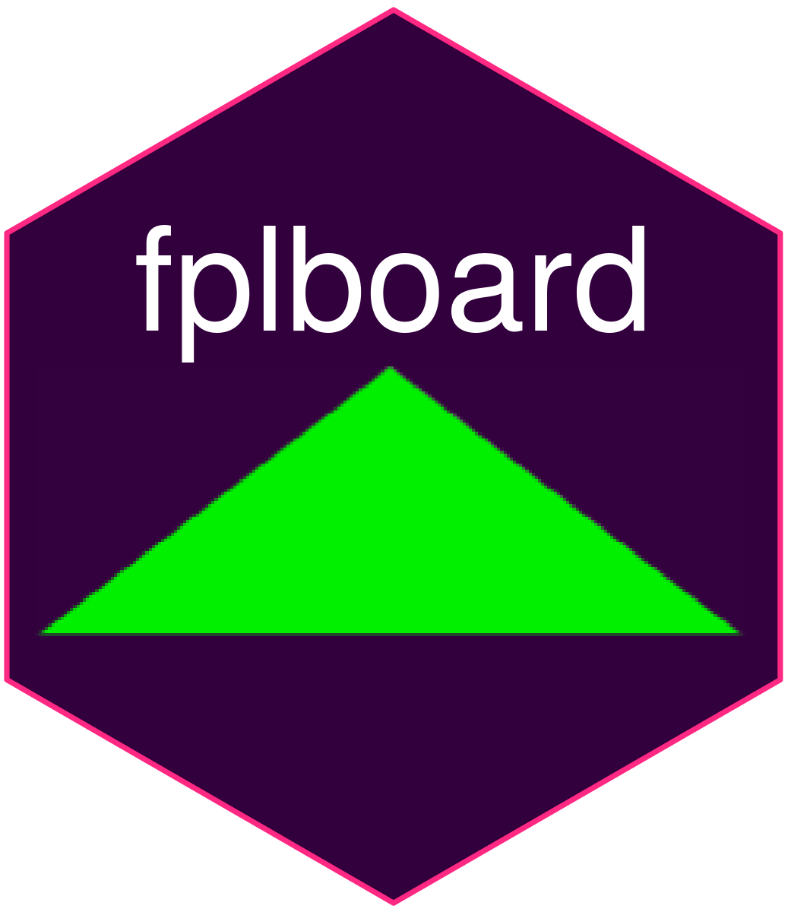

<!-- README.md is generated from README.Rmd. Please edit that file -->

```{r, include = FALSE}
knitr::opts_chunk$set(
  collapse = TRUE,
  comment = "#>",
  fig.path = "man/figures/README-",
  out.width = "100%"
)
```

# fplboard 

<!-- badges: start -->
[](https://lifecycle.r-lib.org/articles/stages.html#experimental)
[](https://app.codecov.io/gh/thomaszwagerman/fplboard?branch=main)
<!-- badges: end -->


The goal of fplboard is to create a dashboard to easily extract useful information from the FPL api.

This dashboard is built on top of [fplscrapR](https://github.com/wiscostret/fplscrapR), but also has its own native functions.

## Installation

You can install the development version of fplboard like so:

``` r
remotes::install_github("thomaszwagerman/fplboard")

library(fplboard)
```

## Example

This is a basic example which shows a function that return an expected points (EP) table for a given mini league.

Under the hood it relies on `fplscrapR`'s `get_league_entries()` and `get_player_info()` functions. 

Let's have a look at the ranks:

```{r example, echo = FALSE}
library(fplboard)
library(flextable)

benchwarmers <- get_ep_for_league(league_number = 570437, gameweek = fplboard::get_current_gw_number())

benchwarmers |> 
  flextable() |> 
  theme_vanilla()
```
Or visualising my mini league rank, using `get_league_entries()` information.

``` {r ranked_plot, echo = FALSE, warning = FALSE}
library(fplboard)
plot_league_standings(570437)
```

