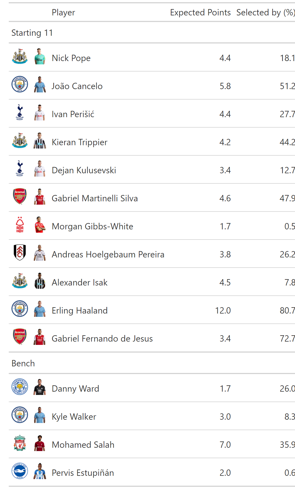

<!-- README.md is generated from README.Rmd. Please edit that file -->

```{r, include = FALSE}
knitr::opts_chunk$set(
  collapse = TRUE,
  comment = "#>",
  fig.path = "man/figures/README-",
  out.width = "100%"
)
```

# fplboard 

<!-- badges: start -->
[](https://lifecycle.r-lib.org/articles/stages.html#experimental)
[](https://app.codecov.io/gh/thomaszwagerman/fplboard?branch=main)
<!-- badges: end -->


The goal of fplboard is to create a dashboard to easily extract useful information from the FPL API.

This dashboard is built on top of [fplscrapR](https://github.com/wiscostret/fplscrapR), but also has its own native functions.

fplboard is built in a modular way using the golem framework. Each module has its own functionality and is an individual menu item, meaning features will be added to this package slowly over time.

## Installation

You can install the development version of fplboard like so:

``` r
remotes::install_github("thomaszwagerman/fplboard")

library(fplboard)
```

## Examples

This is a basic example which shows a function that return expected points table for a given team.

Under the hood it relies on `fplscrapR`'s `get_entry_player_picks()` and `get_player_info()` functions. 

Let's have a look at the table:

```{r example, echo = FALSE, message = FALSE, warning = FALSE, eval = FALSE}
library(fplboard)
library(knitr)

benchwarmers <- get_ep_for_entrant(entrant_number = 9680, gameweek = get_current_gw_number())

benchwarmers <- benchwarmers |>
  dplyr::select(.data$team_code, .data$photo,
                "Player" = .data$playername,
                "Expected Points" = .data$ep_next,
                "Selected by (%)" = .data$selected_by_percent) |>
  gt::gt() |>
  gtExtras::gt_img_rows(.data$photo, img_source = "web") |>
  gtExtras::gt_img_rows(.data$team_code, img_source = "web") |>
  gt::cols_label(
    team_code = "",
    photo = ""
  ) |>
  gt::tab_row_group(
    label = "Bench",
    rows = c(12:15)
  ) |>
  gt::tab_row_group(
    label = "Starting 11",
    rows = c(1:11)
  )  

```

<p align="center"></p>


Another bit of functionality is plotting minileague point over time, using `get_league_entries()` information:

``` {r point_plot, fig.height = 8, fig.width = 16, echo = FALSE, warning = FALSE}
library(fplboard)
library(ggplot2)
plot_league_points(570437)
```

Or by rank for each gameweek:

``` {r ranked_plot, fig.height = 8, fig.width = 16, echo = FALSE, warning = FALSE}
library(fplboard)
library(ggplot2)
plot_league_standings(570437)
```

