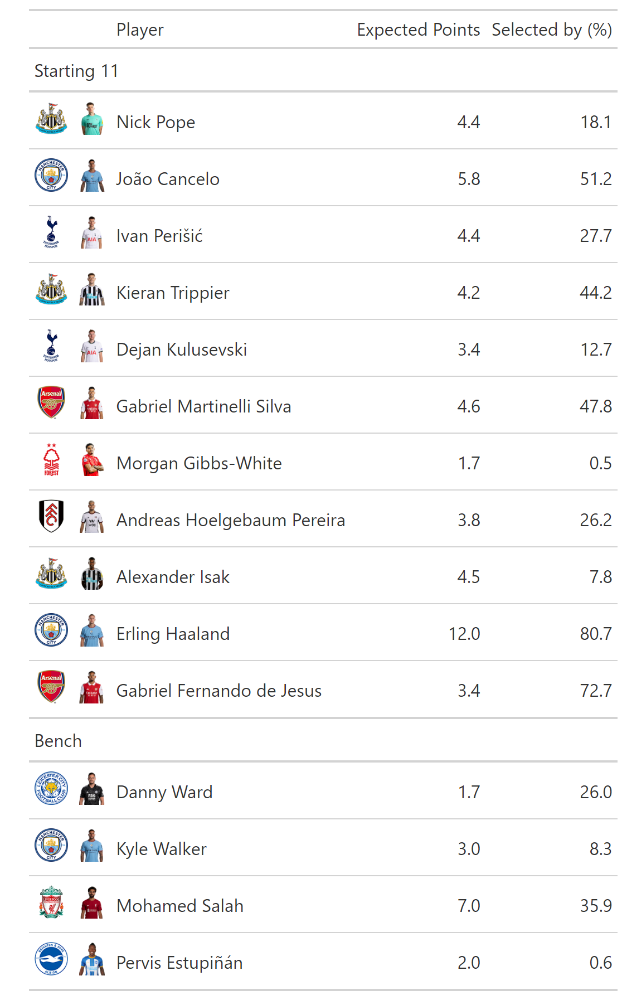

<!-- README.md is generated from README.Rmd. Please edit that file -->

# fplboard 

<!-- badges: start -->

[](https://lifecycle.r-lib.org/articles/stages.html#experimental)
[](https://app.codecov.io/gh/thomaszwagerman/fplboard?branch=main)
[](https://github.com/thomaszwagerman/fplboard/actions/workflows/R-CMD-check.yaml)
<!-- badges: end -->

The goal of fplboard is to create a dashboard to easily extract useful
information from the Fantasy Premier League (FPL) API.

This dashboard is built on top of
[fplscrapR](https://github.com/wiscostret/fplscrapR), but also has its
own native functions.

fplboard is built in a modular way using the golem framework. Each
module has its own functionality and is an individual menu item, meaning
features will be added to this package slowly over time.

The dashboard's theme is imitating the [FPL's website](https://fantasy.premierleague.com/). The goal of fplboard is just to have a bit of fun with your team's or mini-league data. From a developer's perspective, I'm experimenting with ways of presenting data in R/Shiny (I think there's ggplot, kable, gt and reactable so far), as well as some trying some Shiny development techniques (implementing reactive themeing, custom loading screens).

## Installation

You can install the development version of fplboard like so:

``` r
remotes::install_github("thomaszwagerman/fplboard")

library(fplboard)
```

If you want to run the app locally, all you need to do is:

``` r
devtools::load_all()

run_app()
```

## Examples

This is a basic example which shows a function that return expected
points table for a given team.

Under the hood it relies on `fplscrapR`’s `get_entry_player_picks()` and
`get_player_info()` functions.

Let’s have a look at the table:

<p align="center">

</p>

Another bit of functionality is plotting minileague point over time,
using `fplscrapR::get_league_entries()` information:


Or by rank for each gameweek:


